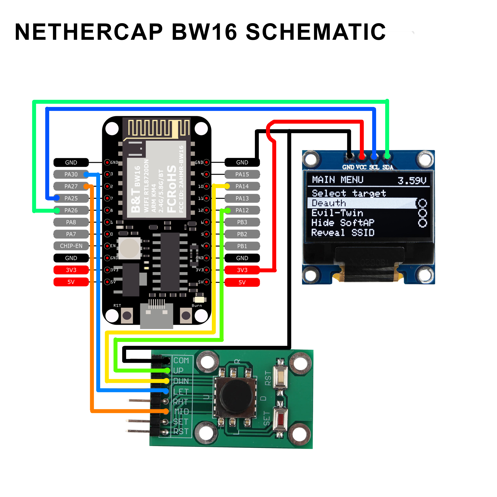
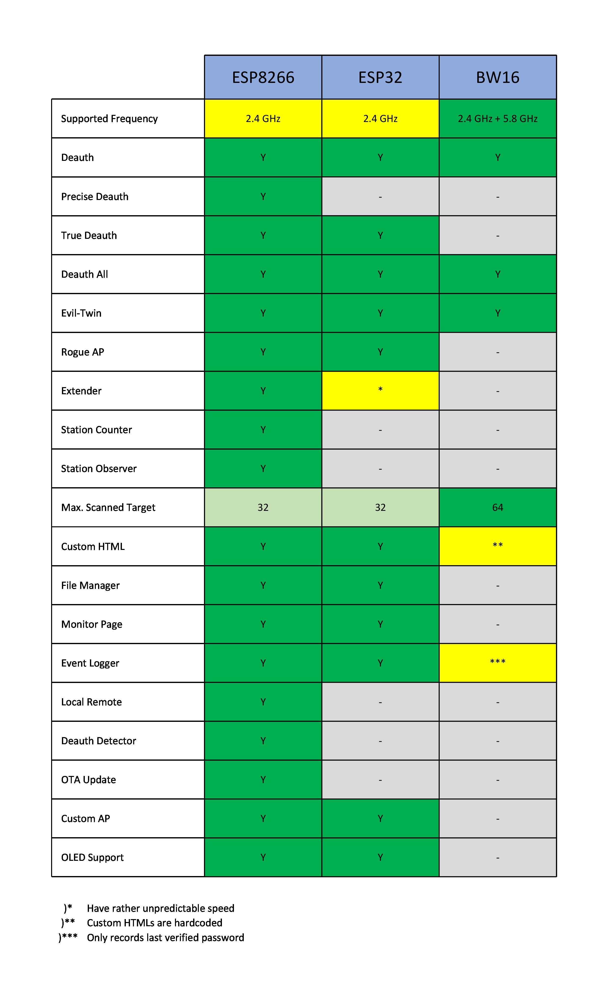

# NETHERCAP
A full-featured Wi-Fi penetration and social engineering tool for ESP8266, ESP-32 and BW16 (RTL8720dn). Go to release page for downloads 
https://github.com/Cancro29/NETHERCAP/releases 

# IF YOU GOT KICKED FROM GROUP...

 
Please join the new NETHERCAP group on Telegram by clicking the link below 
https://t.me/+V3xt1UYs8EQyZWI1

Like this project? Consider giving a star to this repo, I will appreciate that.

# 5 GHz Deauther
5 GHz deauther for BW16 RTL8720dn is available, now suppports Evil-Twin!:
https://github.com/Cancro29/NETHERCAP/releases/tag/V.1.8.2-bw16

# Download
## ESP8266
https://github.com/Cancro29/NETHERCAP/releases/tag/V.3.6.3-esp8266
## ESP-32
https://github.com/Cancro29/NETHERCAP/releases/tag/V.1.0.1-esp32

## About this Project
This firmware is a heavily-modified version of M1z23R's ESP8266-EvilTwin v2 with Spacehuhn's Deauther CSS.
It supports both ESP8266 and ESP-32. For now, it supports English,Indonesian, and custom language.

## Password
The default password for "NETHERCAP" is "deauther".
## Pin and Control Scheme

## Features

.
