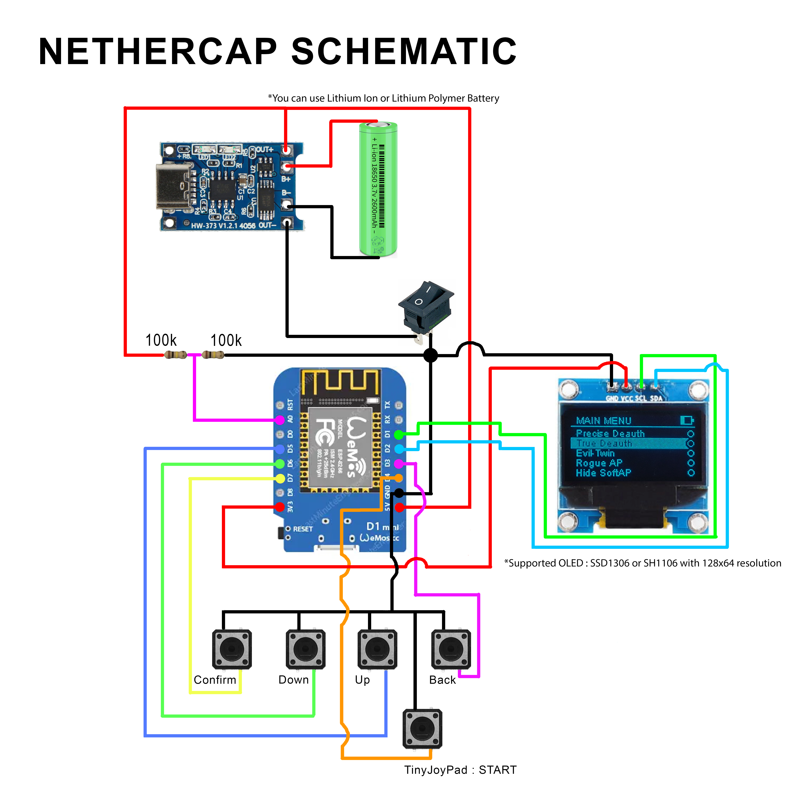

# NETHERCAP
A full-featured Wi-Fi penetration and social engineering tool for ESP8266, ESP-32 and BW16 (RTL8720dn). Go to release page for downloads 
https://github.com/Cancro29/NETHERCAP/releases 

 
or join Telegram Group at  
https://t.me/+CciATlD2mZdkZTNl

Like this project? Consider giving a star to this repo, I will appreciate that.
# Untuk Pengguna di Negara Indonesia
Jangan membeli produk NETHERCAP dari toko daring di bawah ini, karena orang ini melakukan tindakan kurang etis terhadap pembeli berupa pemaksaan rating bintang 5 dan ke developer berupa penghinaan. 
Jika bisa, berikan rating paling rendah pada produk terkait. Apabila sudah terlanjur memberikan rating, perbarui rating dengan review jujur. Jangan takut jika diancam akan dimatikan secara remote atau ancaman lainnya, semua itu bisa diatasi cukup dengan melakukan flashing menggunakan file yang ada di Github ini. 

## Alasan mengapa seller ini harus dihindari -> [Notice](notice2.md)
 
 
 
 

# 5 GHz Deauther
5 GHz deauther for BW16 RTL8720dn is available now :
https://github.com/Cancro29/NETHERCAP/releases/tag/V.0.6.4-bw16

# Download
## ESP8266
https://github.com/Cancro29/NETHERCAP/releases/tag/V.2.7.2-esp8266
## ESP-32
https://github.com/Cancro29/NETHERCAP/releases/tag/ESP-32

## About this Project
This firmware is a heavily-modified version of M1z23R's ESP8266-EvilTwin v2 with Spacehuhn's Deauther CSS.
It supports both ESP8266 and ESP-32. For now, it supports English,Indonesian, and custom language.

## Password
The default password for "NETHERCAP" is "deauther".
## Pin and Control Scheme

## Features
- Evil-Twin : Customizable HTML page with a custom fake "loading/reconnecting" page.
- Deauth All : Deauth all targets in range.
- Multi-target deauth : Choose more than one target to deauth.
- True Deauth : Constantly deauth nearby networks in real-time.
- Rogue AP  : Create a fake login page that asks for user's credential.
- Auto-resume : Continue operation even after the module gets restarted unintentionally.
- Monitor Page : Monitor and record status and events.
- Logger  : Record events that happened during usage.
- Customizable : Set your own settings and it will stay persistent.
- Sniffing : Count how many users connected to an AP and how much network activities they performed.
- Extender : Connect an AP and then extend it using different AP name.
- File Manager : Upload, choose custom HTML page, or flash firmware in one menu.
- HTML Menu : Choose a custom HTML. You will get the preview so you can see what the target will see.
- Local Remote. Control another NETHERCAP device to make them work together.
- OLED support : Display real-time status. Support SSD1306 and SH1106.

## How to use
- Flash the .bin file using your favorite flasher.For ESP-32 build, please read the instructions first. 
- Connect to "NETHERCAP" Access Point.
- Wait for captive portal to appear or access 192.168.4.1 on your browser.
