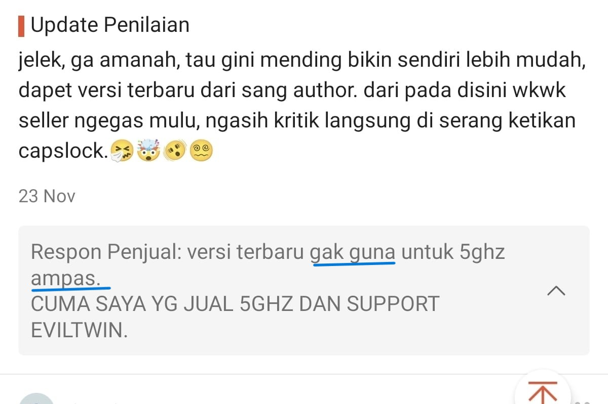
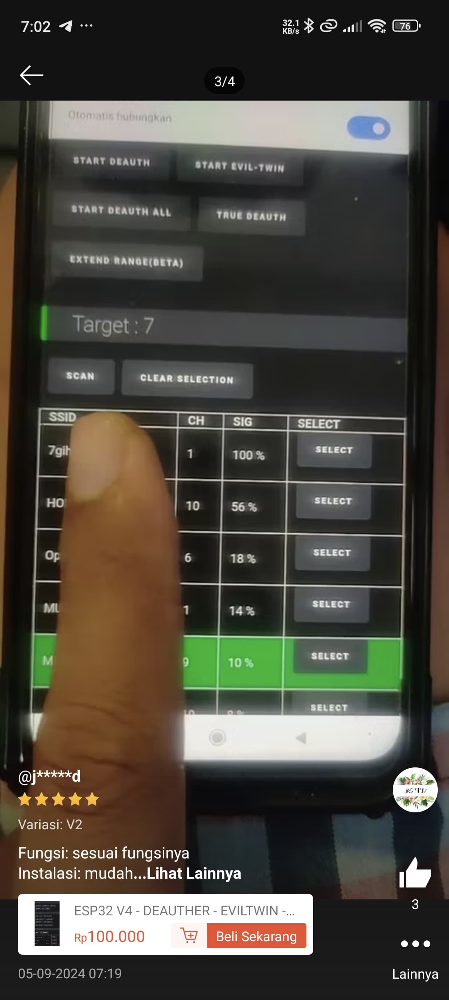
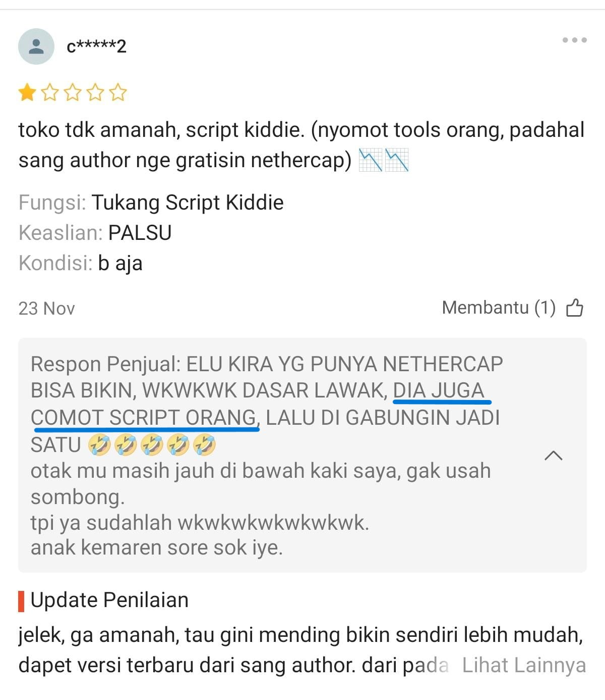
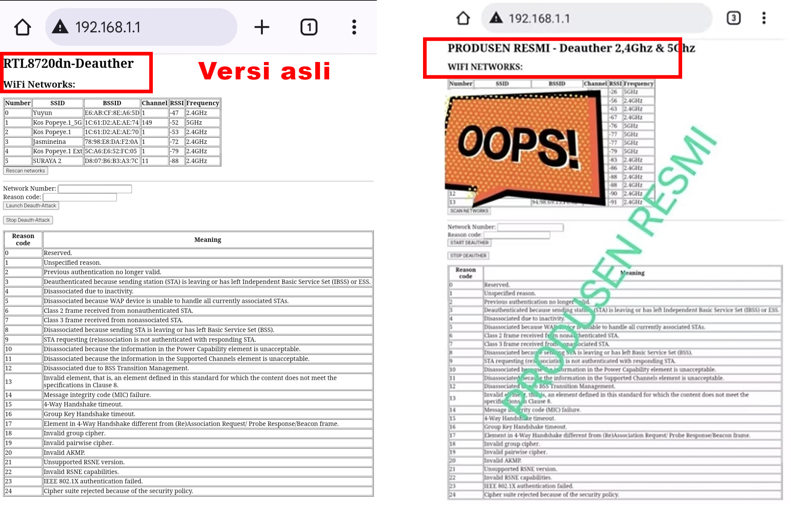
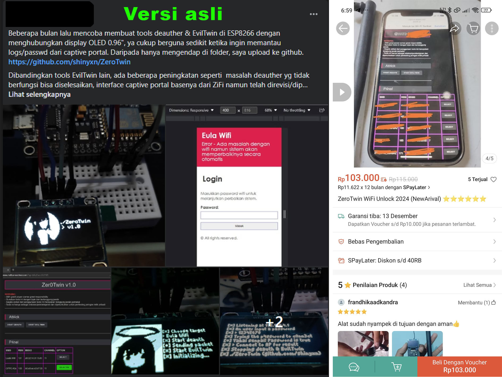
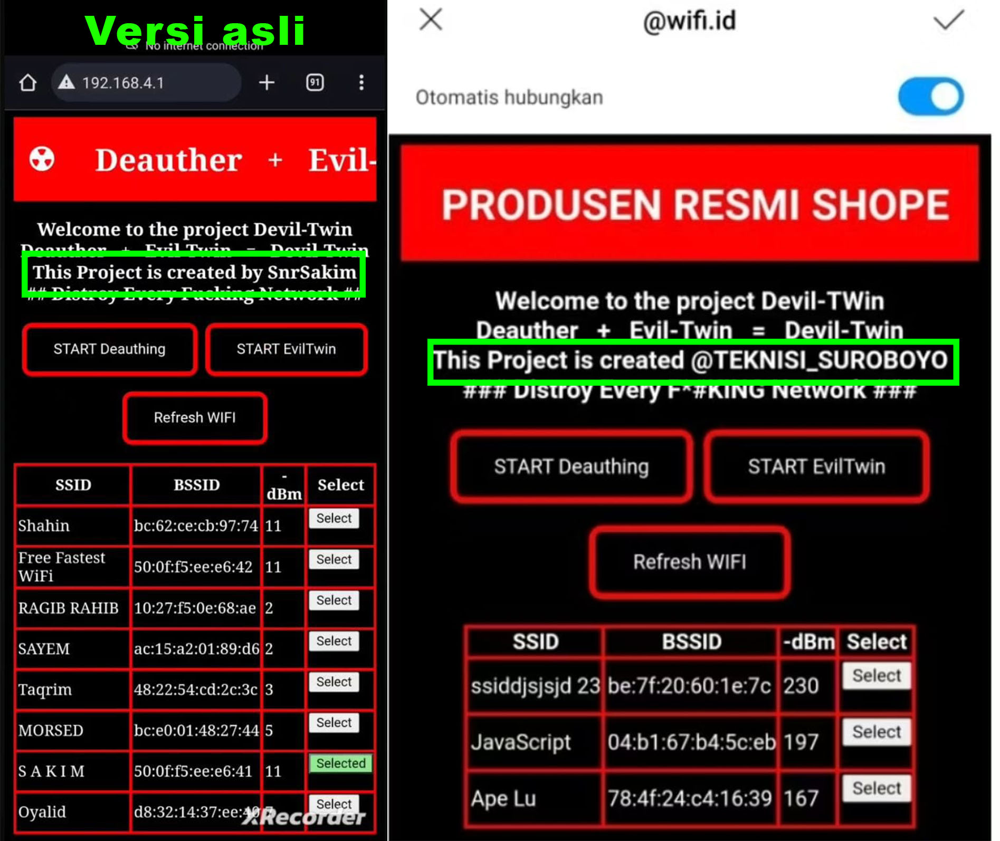

## * FIRMWARE NETHERCAP TIDAK BISA DIMATIKAN DARI JARAK JAUH !. PERLU DIINGAT, DIA TIDAK TAHU CARA MEMBUAT PROGRAM, APALAGI MEMBUAT FITUR REMOTE JARAK JAUH.

# 1. Sombong
## Seller ini terkenal sombong. Dia tidak mempedulikan pembeli yang sudah menyelesaikan pembelian. Tidak ada support, tidak ada penjelasan, cuma selebaran/video sederhana.
 
## Selain itu, dia juga sudah menjelek-jelekkan project saya, padahal dia juga yg jualin project saya.
 

### Dia bilang seperti itu karena saya tidak membagikan deauther 5 Ghz ke publik secara gratis.
### Saya yakin kalau deauther 5 Ghz saya bagikan secara gratis, pasti bakal dijualin juga sama dia
### Kenapa saya yakin? Karena NETHERCAP ESP32 yang masih Alpha (baca: cacat/belum sempurna) aja dia jualin
 

## Tambahan
 
### Code yang ada di project saya ngga modal copas doang, saya juga optimalisasi kodenya, baik dari segi frontend maupun backend.

# 2. Ngaku Produsen, tapi barang yang dia jualin hasil comotan semua
## Contoh 1
 
## Contoh 2
 
## Bahkan project punya orang luar pun dia colong
 
### Dari sini bisa disimpulkan bahwa dia itu tidak bisa ngoding, hanya sebatas edit teks saja (script kiddie).
### Jadi jangan heran kalau fitur-fitur yang dia sebut di produknya itu kebanyakan gimmick atau bahkan bohongan.
### ESP8266 dan ESP32 bukan perangkat yang didesain untuk melakukan peretasan. Tidak ada jaminan project semacam ini work 100%.
